# 
 SQL for Cybersecurity: Filtering and Forensics 

## Project Overview

I simulated the role of a security professional at a large organization and it is my responsibility to investigate all potential security issues, update employee computers as needed, and keep the system secure. This project demonstrates how SQL can be applied to real-world cybersecurity investigations using logical filters and pattern matching.

---

## Process

### Retrieve After-Hours Failed Login Attempts
There was a potential security incident that occurred after business hours (after 18:00). All failed login attempts after office hours need to be investigated.

The following SQL query filters for failed login attempts that occurred after 18:00:

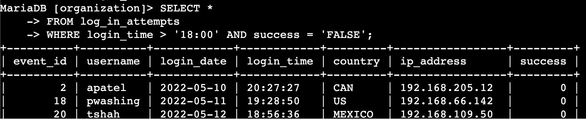

This query selects all data from the `log_in_attempts` table and uses a `WHERE` clause with an `AND` operator to filter the results. The first condition, `login_time > '18:00'`, filters for login attempts after 18:00. The second condition, `success = FALSE`, filters for failed login attempts. This query returned 19 failed attempts after office hours. 

If we were to include all login attempts after hours (both successful and failed), the result would show more rows.

### Retrieve Login Attempts on Specific Dates
A suspicious event occurred on 2022-05-09. To investigate, I reviewed all login attempts from that day and the day before.

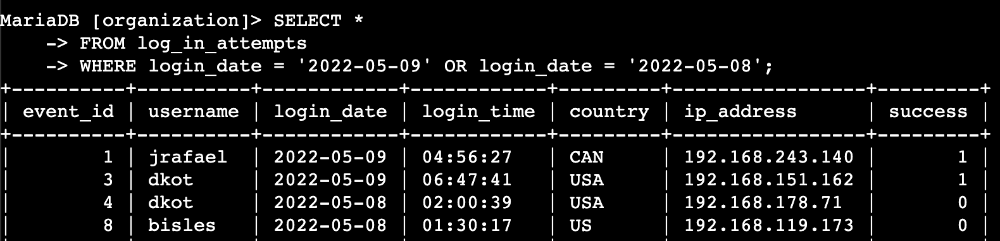

This query filters for login attempts that occurred on either May 8 or May 9, 2022, using the `OR` operator. 

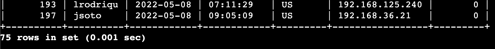
It returned 75 results.

### Retrieve Login Attempts Outside of Mexico
There was suspicious login activity originating from outside of Mexico. I needed to filter out all login attempts that occurred outside of the country. 

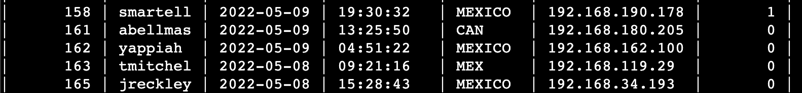

The dataset represents Mexico using both 'MEX' and 'MEXICO'. 

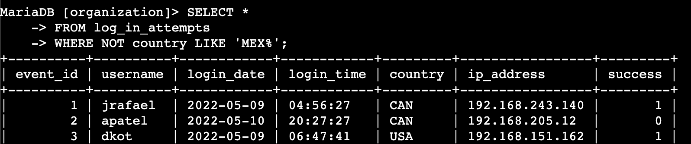

To ensure both are excluded, I used the `LIKE` keyword with a wildcard (`MEX%`) and `NOT` to exclude those rows. 

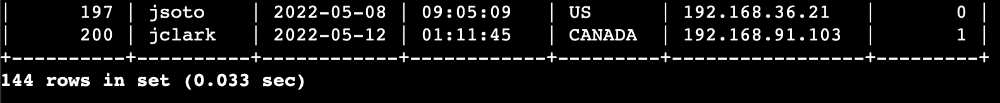

This query returned 144 login attempts that occurred in countries other than Mexico.

### Retrieve Employees in Marketing
Our team needed to apply security updates to machines used by employees in the Marketing department located in the East building.

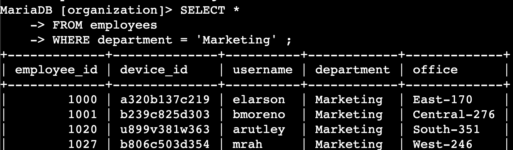

Initially, filtering only by department gave 44 results across all buildings (East, Central, South, West). 

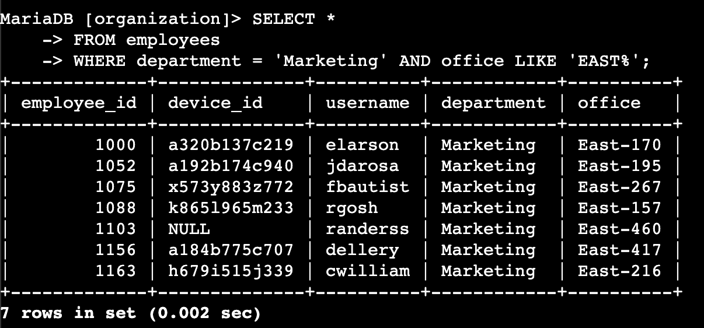

I then refined the search with `LIKE 'East%'` to target only employees in the East building, resulting in 7 matches.

### Retrieve Employees in Finance or Sales
Machines belonging to employees in the Finance and Sales departments needed a different security update.

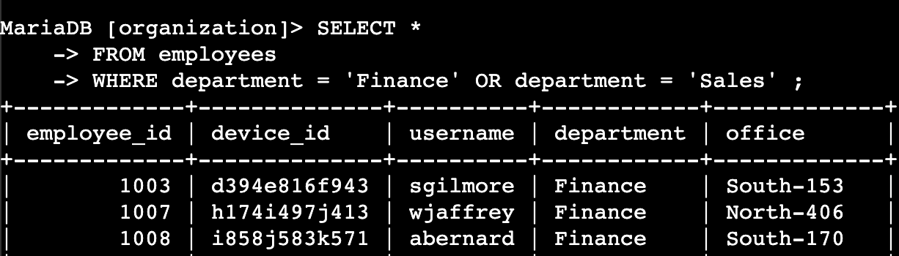

This query uses the `OR` operator to filter employees from either department. 

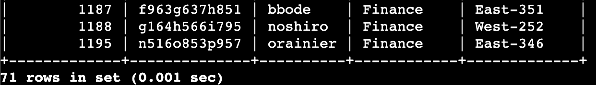

A total of 71 employee machines were identified: 38 in Finance and the rest in Sales.

### Retrieve all Employees not in IT
One final security update needed to be applied to all employees not in the Information Technology department.

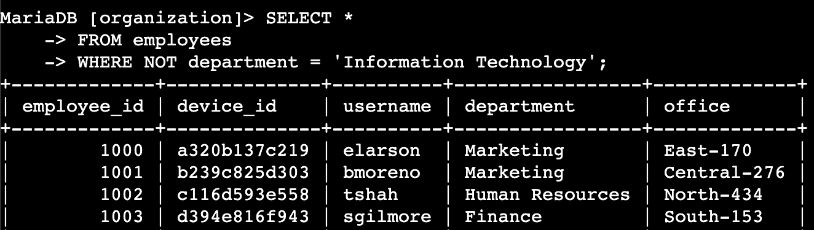

This query uses `NOT` operator to filter out employees whose department is not Information Technology. 

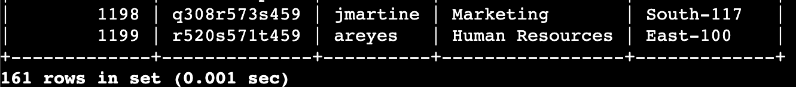

It returned 161 employees across Marketing, Human Resources, Finance, and Sales departments whose machines needed updates.

---

## Summary
By applying SQL filters using `WHERE`, `AND`, `OR`, `NOT`, `LIKE` and `%`, I extracted actionable insights from login and employee data. These queries enabled timely investigation of suspicious activity and ensured targeted security updates for different departments and office locations, supporting proactive system protection.

---