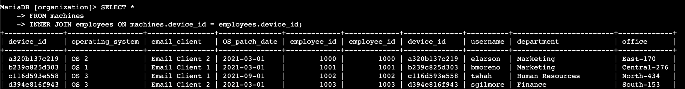
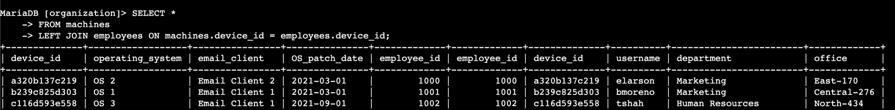
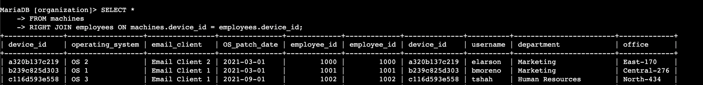
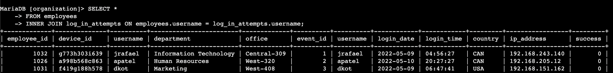
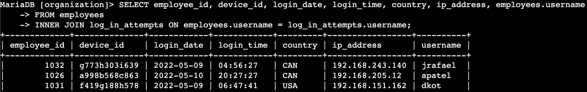

# 
 SQL for Cybersecurity: Joins and Forensics 

## Project Overview

I simulated the role of a cybersecurity analyst to investigate a recent security incident that compromised a few machines.

To carry out the investigation, I used SQL joins to extract and correlate relevant information across tables in the database.

---

## Process

### Match Employees to Their Machines
To begin the investigation, I identified which employees were using which machines.

Using `INNER JOIN`, I matched each machine with its corresponding employee. This query returned **185 records**, showing only entries where both the machine and employee have a matching `device_id`.

### Return More Data with LEFT and RIGHT Joins
To gather more complete information:
* First, I retrieved all machines, including those not assigned to any employee:

Using `LEFT JOIN`, I returned **200 records**, showing all machines and any associated employee data (null if unassigned).

* Then, I retrieved all employees, including those not assigned to any machine:

I also retrieved the information of all employees and any machines that are assigned to them.

Using `RIGHT JOIN`, I again retrieved **200 records**, showing all employees and any linked machine data.

### Retrieve Login Attempt Data
To further investigate suspicious activity, I examined login attempts made by employees.

This `INNER JOIN` connected the employees and log_in_attempts tables using the shared username column. The query returned **200 records** of login activity tied to valid employees.

To eliminate duplicate columns and display only relevant details:

This refined query still returned **200 records**, but with filtered columns. It avoids redundancy by selecting only one username column. Once suspicious logins are detected, I can refer back to this data to identify the corresponding department and office, and inspect the devices further.

---

## Summary

In response to a recent security incident, I used SQL joins  (`INNER JOIN`, `LEFT JOIN`, `RIGHT JOIN`) to correlate employees, their devices, and login data.

This helped identify unauthorized access, unassigned or unmanaged devices, and suspicious login behavior. The analysis enabled timely incident response and supported effective security measures.

---